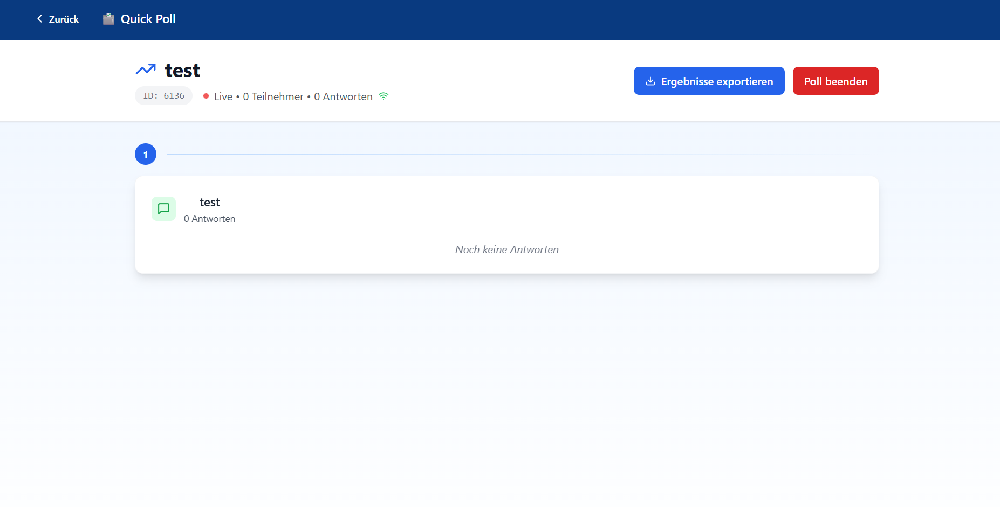

# Poll starten

<figure><figcaption></figcaption></figure>

Im "Poll starten"-Menü können Live-Ergebnisse der Umfrage eingesehen werden.&#x20;

\
Ergebnisse exportieren - Exportiert die Umfrageergebnisse im CSV-Format\
Poll beenden - Beende die Umfrage manuell vor Ablauf der Frist
