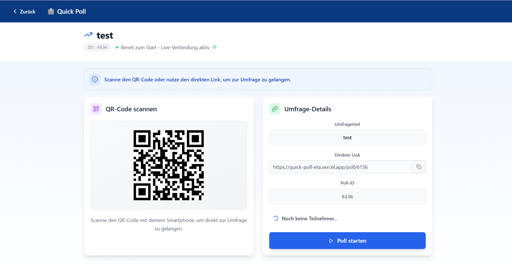

# Poll verwalten

\

<figure><figcaption></figcaption></figure>

Im "Verwalten"-Menü können Teilnehmer per QR-Code an der Umfrageteilnehmen.\
Eine Teilnahme per Link ist ebenso möglich.\
Mit Klick auf "Poll starten" geht die Umfrage live.
