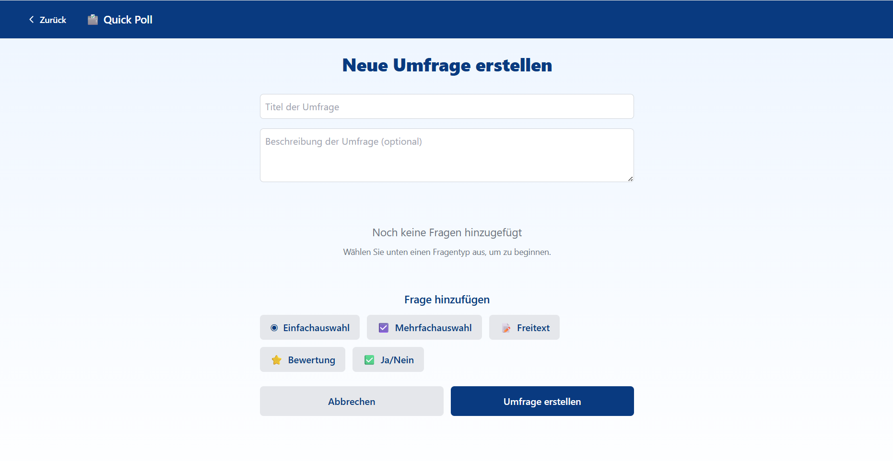

# Poll erstellen

<figure><figcaption></figcaption></figure>

Im "Poll erstellen" Menü werden Umfragen erstellt. Umfragen können beliebig viele Fragen folgender Fragetypen enthalten:\
\
Einfachauswahl - Umfrageteilnehmer können nur eine Antwortoption auswählen\
Mehrfachauswahl - Umfrageteilnehmer können beliebig viele Antwortoptionen auswählen\
Freitext - Umfrageteilnehmer können eigene Antworten formulieren\
Bewertung - Umfrageteilnehmer bewerten von 1 (schlecht) bis 5 (gut)\
Ja/Nein - Umfrageteilnehmer antworten mit Ja oder Nein\
\
Um eine Umfrage erstellen zu können, muss ein Umfragetitel und Fragetitel gewählt werden. \
"Umfrage erstellen" leitet dich zur "Meine Polls"-Ansicht weiter.
